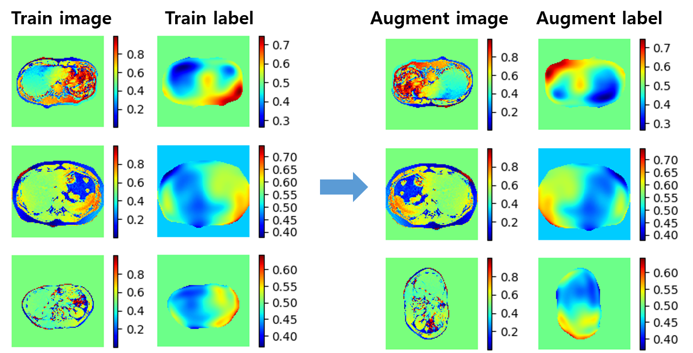
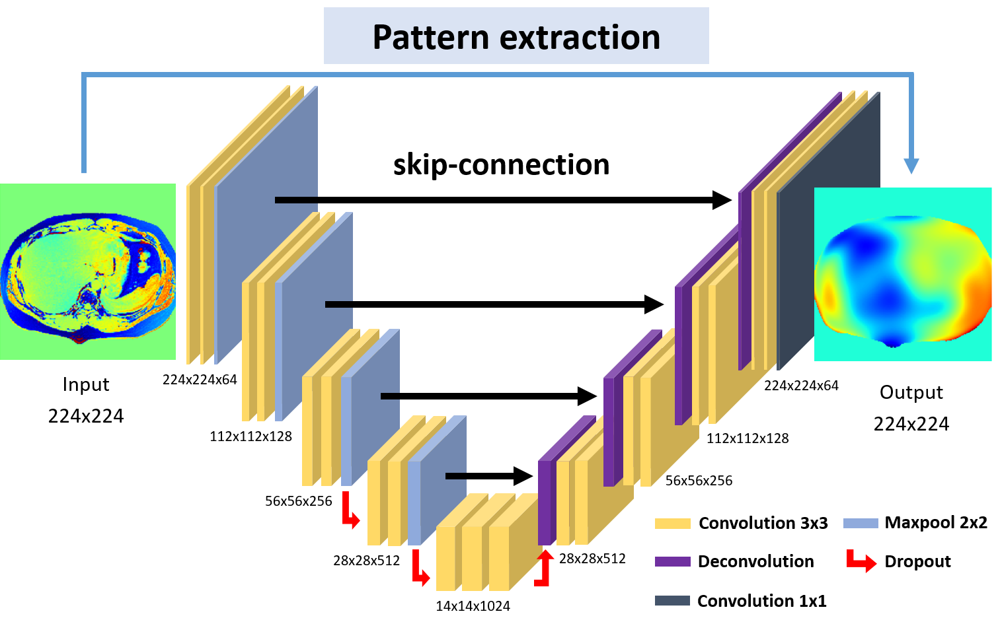
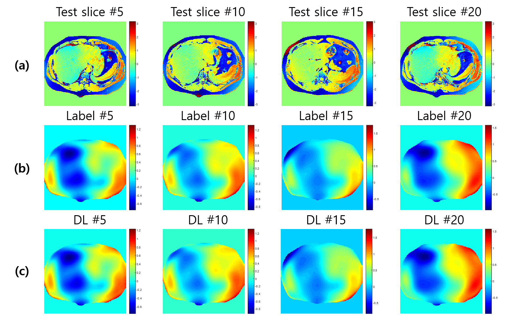
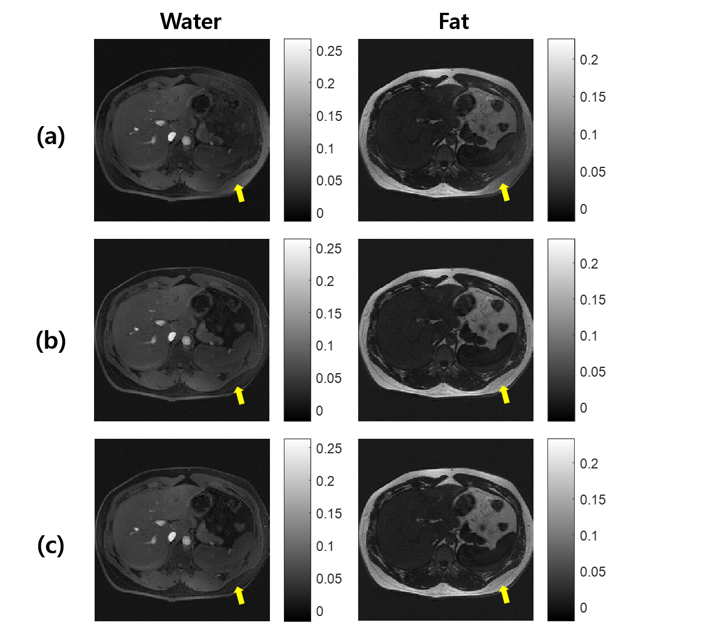
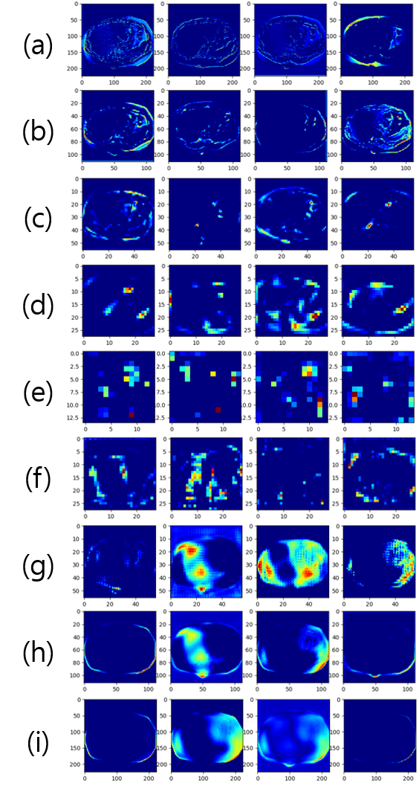

# KERAS_UNET_FOR_MAT

###### Implementation of the Keras U-Net for ".mat" file of MATLAB.

###### Image pattern extraction using U-Net 

##  
## Requirements

###### (Windows) Python 3.5.2 ver

###### Details are shown below.

~~~
Keras==2.0.4

tensorflow-gpu==1.6.0

scipy==1.0.0

numpy==1.14.2

matplolib==2.1.1

~~~

##  
## Augmentation

###### image augmentation with rotation 90 degree, up-down filp, left-right flip randomly.

##  
## Model

###### U-Net-based model for pattern extraction

###### U-Net
> U-Net: Convolutional Networks for Biomedical Image Segmentation   <U-net/> <https://arxiv.org/abs/1505.04597>
###### slight reference code
> https://github.com/jocicmarko/ultrasound-nerve-segmentation/

##  
## Results
### Deep-Learning results
###### A few slices of Input image, Label image, Result image comparison

###### (a) Input image (with field inhomogeneity artifact in MRI, out-of-phase angle image)
###### (b) Label image (with field inhomogeneity artifact removal "SUPER" method in MRI) 
> "SUPER" method <SUPER-method/> https://synapse.koreamed.org/DOIx.php?id=10.13104/imri.2018.22.1.37
###### (c) Deep-Learning result image

- - -
### Water-Fat seperation result

###### (a) Before artifact removal
###### (b) After artifact removal with "SUPER" method
###### (c) After artifact removal with trained "SUPER" method Deep-Learning

##  
## Feature visualization

###### (a) Conv2D layer1
###### (b) Conv2D layer2
###### (c) Conv2D layer3
###### (d) Conv2D layer4
###### (e) Conv2D layer5
###### (f) Deconvolution layer1
###### (g) Deconvolution layer2
###### (h) Deconvolution layer3
###### (i) Deconvolution layer4
